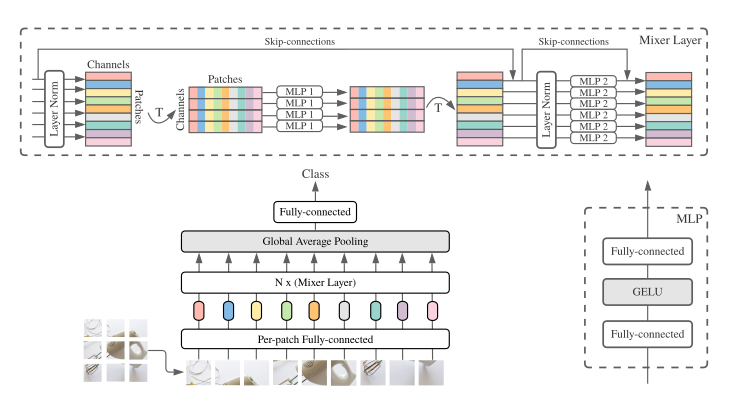

# mlp-mixer
MLP-Mixer: An all-MLP Architecture for Vision

</img>
## Citations

```bibtex
@misc{tolstikhin2021mlpmixer,
    title   = {MLP-Mixer: An all-MLP Architecture for Vision},
    author  = {Ilya Tolstikhin and Neil Houlsby and Alexander Kolesnikov and Lucas Beyer and Xiaohua Zhai and Thomas Unterthiner and Jessica Yung and Daniel Keysers and Jakob Uszkoreit and Mario Lucic and Alexey Dosovitskiy},
    year    = {2021},
    eprint  = {2105.01601},
    archivePrefix = {arXiv},
    primaryClass = {cs.CV}
}
```

## Usage

```python
import torch as tr
from mlp_mixer import MLPMixer

model = MLPMixer(
    image_dim = 224,
    patch_size = 16,
    embedding_dim = 256,
    hidden_dim = 512,
    num_blocks = 8,
    num_classes = 100,
    dropout = 0.2,
    channels = 3
)

img = tr.randn(1, 224, 224, 3)
pred = model(img) # (1, 100)
